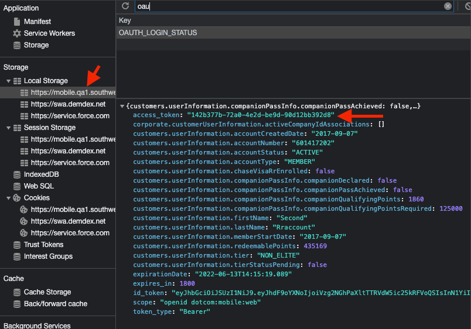
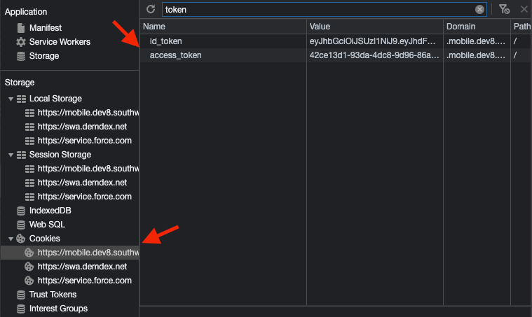

# API Gateway Error Pattern

## Summary

The data flow we have for API GW project is very simple. We have some defined error codes that are related to API Gateway. Based on the user request and API call, we might get one of the following errors. Instead of showing error to the user we take some actions to rehydrate the session. This rehydration might include asking user to reLogin again.

## API Types

### Protected APIs
 - User needs to be in HOT state, if session is expired, user will receive API GW error \
 - User will receive API GW error if in logged out state

### Elevated APIs
 - If session is expired, and expired token is sent along with the request, we will receive API GW error \
 - User is able to make a successful call in logged out state

### Unprotected APIs
 - If session is expired, user is able to make a successful call \
 - User is able to make a successful call in logged out state


### List of all Protected and Elevated APIs
https://confluence-tools.swacorp.com/pages/viewpage.action?pageId=378667076

## Error Codes
All API GW error codes are listed in `errorCodes.js`


## Cookies Vs Local Storage
In this project we use Cookies to store access_token  and id_token . Before this project access_token  is being stored in Local storage.

**Before API GW project**



**After API GW Project**




## API GW Error Types

### ReLogin
When user gets this type of error we need to show reLogin page. User has no cancel option. But based on the page, they might have continued as guest (Guest flow needs to be defined on page level, otherwise it won't show up on the reLogin page)

### ReAuthenticate
This type requires re-authentication. In this type show reLogin modal and user has cancel option, once they hit cancel it redirects them to the home page.

### Retry
The third type is just a retry option, we first clear the session and them we remake the same call that was failed


**Handling different types of errors are in `restClient.js` file**

```javascript
if (_.values(GATEWAY_RELOGIN_ERRORS).includes(errorCode)) {
  store.dispatch(showReLoginModal(retryFn));
} else if (_.values(GATEWAY_REAUTHENTICATE_ERRORS).includes(errorCode)) {
  store.dispatch(showReLoginModal(retryFn, { hasCancelButton: true, shouldRedirectToHomePage: true }));
} else if (_.values(GATEWAY_RETRY_ERRORS).includes(errorCode)) {
  store.dispatch(handleNativeLogout());
  store.dispatch(cleanUpEndOfSession());
  store.dispatch(setReLoginCallbackFunctions({}));
  retryFn(true);
}
```

## Corporate Flow

For corporate flow we DO NOT show reLogin modal. When we receive any of API GW errors, we show a pop up on the screen that user session is out and once they click OK, we redirect them to the home page.

## What happens after user reLogins

Here are the actions we take after user reLogins in order (_onSubmit function in reLoginModal file)

 - We retry failed calls and actions
 - Hide reLogin modal (If user successfully logs in)
 - Clear the password
 - If there is any callback defined for that page, we will call
 - Clear all callbacks 

**This logic is in `reLoginModal.jsx` file**

```javascript
loginFn({ userNameOrAccountNumber, password })
      .then(() => this._retryFailedCalls())
      .then(hideReLoginFn)
      .then(() => this._clearPassword())
      .then(postLoginCallbackFn)
      .catch(() => this._handlePromiseCatch())
      .finally(() => this._handlePromiseFinally());
```

## Continue as Guest Flow

It is important to know that continue as guest option is not coming with ReLogin page for free. If any page wants to show continue as guest we need to define it for that specific page.

**Sample code for defining continue as guest flow for a page**

```javascript
setReLoginCallbackFunctionsFn({
          postLoginCallbackFn: fetchSavedCreditCardsFn,
          continueAsGuestFn
        });
```

## Redux state

In redux state we save `reLoginModal`  object that includes following objects:

```javascript
reLoginModal: {
  reLoginLocation: string,
    isActive: boolean,
    reLoginModalOptions: {
    hasCancelButton?: boolean,
      shouldRedirectToHomePage?: boolean,
      isAccountNumberEditable?: boolean
  },
  retryFunctions: [() => *],
  reLoginCallbackFunctions: ?ReLoginCallbackFunctionsType
}
```
#### reLoginLocation: 
    indicates the url of the page that reLogin shows up on the screen 
####  isActive:
    indicates if reLogin modal is on the screen or not
#### reLoginModalOptions
    If we have any options for that modal, we can define it in this object
#### retryFunctions
    the failed calls that we need to remake, after reLogin
#### reLoginCallbackFunctions
    if we have some actions that we want to take after retrying failed calls, we defined them in postLoginCallbackFn  and if we need a guest flow we define a function for it in continueAsGuestFn  

