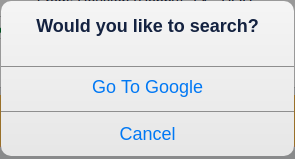
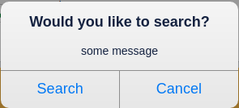

# Dialog Pattern

## Redux version

### Summary

Provides an overview for Redux Dialog usage.
There are two types of Dialogs supported: **Vertical Links Dialog** and **Button Dialog**.

### component

`Dialog.jsx` connects `state.app.dialog` to get information of should dialog show (by`active`) and what to show.

`VerticalLinksPopup` and `ButtonPopup` have similar functions. The only difference between them is that `VerticalLinksPopup` renders buttons vertically, and `ButtonPopup` renders buttons horizontally.

If you want to use `VerticalLinksPopup`, you should pass `verticalLinks` by dialog options, and If you want to use `ButtonPopup`, you should pass `buttons`.

### Functionality

The Redux Dialog provides show, hide and force hide functionality.

| Dialog          |
| --------------- |
| showDialog      |
| hideDialog      |
| forceHideDialog |

### Sample Vertical Links Dialog



**Code Vertical Links Dialog**

```javascript
showDialogFn({
  title: 'Would you like to search?', // Dialog title
  closeLabel: CANCEL, // Default close button label
  message: '', // Message is centered and appears under the title and above the buttons
  contentView: '', // Content view appears under the message and is centered
  verticalLinks: {
    links: [
      {
        // Array of links
        label: 'Go To Google', // Label for the link
        href: 'http://www.gooogle.com', // Link URL
        onClick: hideDialogFn, // Hides dialog when clicked
        isExternal: true, // Boolean to indicate an external link
        dataQa: 'goToGoogleLink' // Use by QMO for automated testing
      }
    ]
  }
});
```

### Sample Button Dialog



**Code Button Dialog**

```javascript
showDialogFn({
  title: 'Would you like to search?', // Dialog title
  name: 'qa-name', // Use by QMO for automated testing
  message: 'some message', // Message is centered and appears under the title and above the buttons
  contentView: '', // Content view appears under the message and is centered
  buttons: [
    {
      dataAnalytics: '', // ???Optional marker for analytics
      label: 'Search', // Label for the button
      onClick: () => _onClickHandler // Function called when button is clicked
    },
    {
      label: 'Cancel', // Label for the button
      onClick: hideDialogFn // Function called when button is clicked
    }
  ]
});
```

### Usage with Promise

Custom code can be executed after the Dialog is hidden.

```javascript
DialogActions.hideDialog().then(() => {
  LocalStorageCache.deleteFromLocalStorage(CHASE_SESSION_ID_KEY);
  this.props.history.push(transitionOnError);
});
```

### action

We can dispatch `showDialog` and `hideDialog` action to toggle it.

Note that we'll push a new location based on current location information with ` state: {popup: 'open'}`. Then we should go back once dialog hidden to maintain the consistency of history.

When dialog pop up, and browser back happens, `toggleDialog(false))` will be dispatch, dialog will be hidden.
If we dispatch `hideDialog` directly, browser back will be invoke.

## todo

- unify `onClose` behaviour and extend ability to add customize `onClose` call back

  All the dialogs will close once user clicks button on it, but we pass onclick function every time, it's unnecessary. There should be a uniform `onClose` behaviour regardless it's `ButtonPopup` or `VerticalLinksPopup`, then we can pass customize `onClose` call back easily.

- replace force hide dialog

  forceHide dialog is only used for error pop up of chase offer apply page. we can check can we handle it in a general way.
