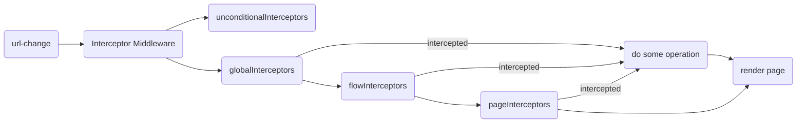

# Interceptor

## What is it

We use interceptor to intercept back/forward/refresh behavior in special scenarios.

## How to do

### Data flow



### Usage

- interceptorMiddleware.js

  - if you want to add interceptor used for whole app, put it in globalInterceptors.

  ```js
  const globalInterceptors = [
    [isBrowserRefresh, refreshInterceptor],
    [isTransitionWithForceRedirect, forceRedirectInterceptor],
    [isAddingForceRedirect, addForceRedirectFlagInterceptor]
  ];
  ```

  - if you want to add interceptor used for assigned flow, put it in flowInterceptors.

  ```js
  const flowInterceptors = [
    [isFlowPath(carCancel.path), carCancel.interceptor],
    [isFlowPath(flightStatus.path), flightStatus.interceptor]
  ];
  ```

  - if you want to add interceptor used for assigned page, put it inside flowInterceptors.

  ```js
  const pageInterceptors = [
    [isPagePath(config.pages.flightStatusLandingPage), restartFlightStatusInterceptor],
    [isPagePath(config.pages.flightStatusRecentPage), recentSearchRefreshInterceptor]
  ];
  ```

  - if you want to add an interceptor for the whole app that always runs without short circuiting other interceptors, put it inside unconditionalInterceptors (keep in mind that unlike the other interceptors, unconditionalInterceptors are functions that don't return anything)

  ```js
  const unconditionalInterceptors = [resumeAppStateCleanUpInterceptor];
  ```

- add flow interceptor

  - create a flow interceptor file and put it into `src/shared/interceptors/flowInterceptors/` folder.

  - details about how to add flow interceptor, please refer to `src/shared/interceptors/flowInterceptors/carCancelInterceptor.js`.

  - ```js
    const config = {
      name: 'carCancel',
      path: '/car/cancel'
    };

    const interceptor = (interceptorContext) => {
      const { store } = interceptorContext;
      const flowConfig = _.get(routeFlowConfigGetter(store), `${config.name}.flowConfig`, {});
      return _.someExecute([cleanFlowInterceptor, redirectFlowInterceptor])({ ...interceptorContext, flowConfig });
    };

    export default {
      ...config,
      interceptor
    };
    ```

  - routeFlowConfigGetter - similar with the `routeFlowConfig`

    - ```js
      export default (store) => ({
        carCancel: {
          flowConfig: {
            entry: '/view-reservation/',
            exit: '/car/cancel/confirmation',
            flowStatusGetter: () => flowStatusStore.state.carCancel
          }
        }
      });
      ```

    - we can use `store` to dispatch action and get state from redux tree

- something also need to know.

  - the difference between `_.cond` and `_.someExecute`?
    - `_.cond` takes an array where each array item has 2 elements: the condition and interceptor. The interceptor has `return type InterceptorContext`.
    - `_.someExecute` takes an array of interceptors. The interceptors return an interceptor function when the condition is true and returns nothing otherwise.
  - why use `routeFlowConfigGetter(store)`?

    - Defines the flowConfig, optional flowStatusGetter and flowCleaner, and actions can be dispatched using the store parameter to `routeFlowConfigGetter`.

- remove the flowInterceptor/pageInterceptor from `xxx/index.js` file.
